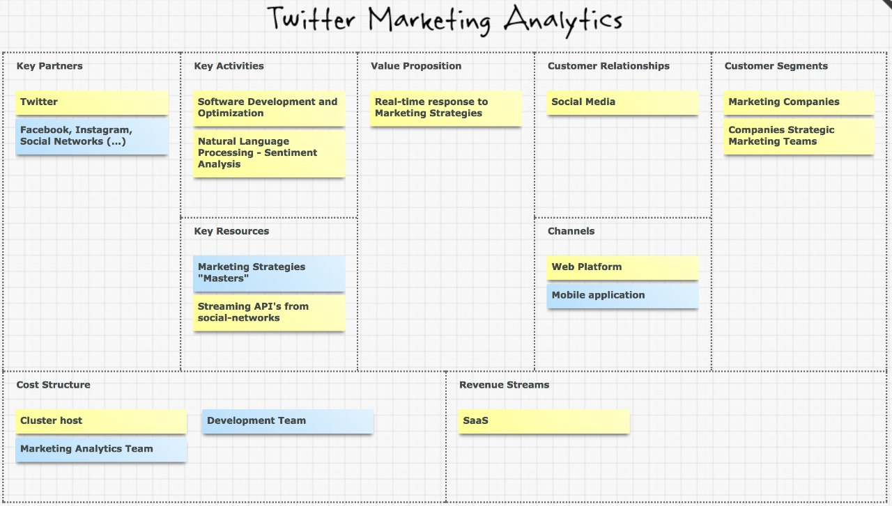
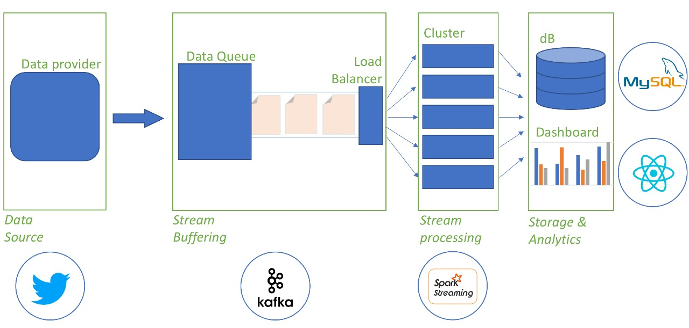
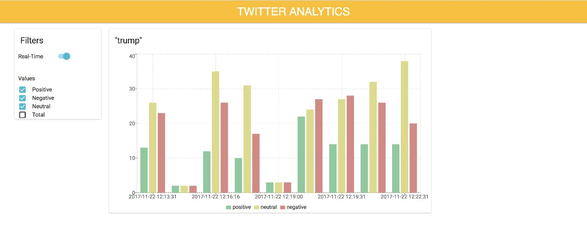
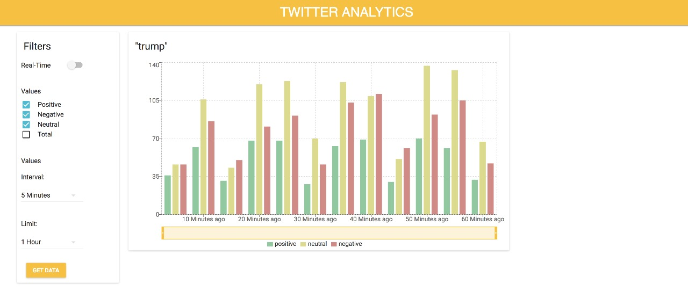

# MarketingAnalyticsTwitter

Project for BigData Discipline (Prof. Fabio Ayres) - Insper - Computer Engineering Program

## Project Description

### Business Model

The goal of this is project is to provide a tool to better understand user reaction to marketing campaigns or even popularity of
specific topic. Designed for Marketing Companies and Companies' Marketing Areas, this project has a dashboard that allows its users to monitor natural language interpreted sentiment from Tweets in real-time to better understand behavior and get insights for future campaigns.

The Business Model Canvas:


### Technologies Involved

To achieve the real-time processing we used a BigData Stream Processing paradigm. We used [Kafka](https://kafka.apache.org/) to manage the Stream of data. A Twitter API to collect tweets filtered by word of choice served as **Producer** and [SparkStreaming](https://spark.apache.org/streaming/) with PySpark to process micro-batches of raw Tweets into sentiment value, it serves as **Consumer** to Kafka's topic.

A **React** designed dashboard interacts with end-users providing the information from the tweet's sentiment analysis. Along with a **Python Flask** server the application distributes the data from SparkStream to both a **MySQL Database** for future analysis and long-term storage.



### Dashboard Interface

The react based dashboard uses the [Rechart](http://recharts.org/) library to plot and [Material UI](http://www.material-ui.com/) to compose the css and the basic components.
It Allows users to analyze incoming real-time data from tweets and to collect values from the MySQL database from a specified interval for item and a specified amount of time in the past.

**REAL-TIME MODE**


**STORED DATA MODE**


## Running the application

As previously said, the application is based on a [Kafka Producer](kafka_test.py), a
[SparkStream Consumer](spark_consumer.py), a [Flask API](api/server.py), a
[MySQL database](sql/schema00.sql) and a [React FrontEnd](front_end). Each part of the
application has it's own dependencies, which are listed bellow.

### Pre-requirements

  * Kafka Producer

    Download [Kafka 2.11 or 2.12 binaries](https://kafka.apache.org/downloads) and decompress it.

    Download *Python3 Twitter Integration* with `# pip3 install twitter` and *Python3 Kafka Integration* with `# pip3 install kafka-python`. You'll also need to create a twitter API key and save it on your home folder in a file named `twitter_keys.txt` with each line being the value, as bellow:

    ```
    consumer key
    consumer secret
    access key
    access secret
    ```

    The producer has a direct communication with the *MySQL database*, so the MySQL configurations are also a requirement here.

  * SparkStream Consumer

    Download [Spark 2.2 binaries](https://spark.apache.org/downloads.html) and decompress it. Spark itself requires *Scala*, so you'll need to install that too. For Ubuntu, `# apt install scala` should resolve it. With that done, add spark's bin folder to your path, so that you can run spark commands from any directory in your machine with ease.

    With that, you'll need to download *Python3 Natural Language Took Kit (nltk)* with `# pip3 install nltk`, then, open a python3 terminal and import the nltk package (`>>> import nltk`) and then run `>>> nltk.download()`, which should open new window. On the *Models* tab, download the *vader_lexicon* package.

    With all of that, the last thing needed for the SparkStream Consumer is to configure Python 3 for *PySpark*. First, download the *PySpark* package with `# pip3 install pyspark`. Then, set *PySpark* default Python to Python 3 by using `$ export PYSPARK_PYTHON=/usr/bin/python3` and `$ export PYSPARK_DRIVER_PYTHON=python3`. To avoid typing it every time you open a new terminal window, we advise you add those two lines to your .bashrc or equivalent.

    The consumer has a direct communication with the *MySQL database*, so the MySQL configurations are also a requirement here.

  * Flask API

    Install *Flask for Python3* with `# pip3 install flask`.

    The API has a direct communication with the *MySQL database*, so the MySQL configurations are also a requirement here.

  * MySQL database

    Install *MySQL Server*. We suggest downloading *MySQL Workbench* too for running the schema easier.

    For creating the database, just run the [sql/schema00.sql](sql/schema00.sql) script.

    With that, create a configuration file named `mysql-keys.txt` in your home folder with each line being as bellow:

    ```
    host
    user
    password
    ```

    The default value for host is `localhost`, for user it's `root` and for password it's `1234`. If the file doesn't exists, the code will try to use those values, which might get you an error in case those aren't true for your computer.

    After that, install the *Python3 MySQL connector* with `# pip3 install mysql-connector-python` for accessing the DB inside the code.

  * React FrontEnd

    For installing and configuring the frontend of the application, you'll simply need to have *node* of version 6 or greater, alongside *npm*. With those, just run `$ npm install` to install all other dependencies.

### Running commands

  With all the dependencies resolved (including the creation of the initial database), run the commands in the following order (the commands all take the foreground of your terminal, so run each on a different terminal window, or run them in background):

  1. Start Zookeeper + Kafka Streaming Context (inside the Kafka decompressed directory):

     ```
     $ bin/zookeeper-server-start.sh config/zookeeper.properties
     $ bin/kafka-server-start.sh config/server.properties
     ```

  2. Start the Flask API:

     ```
     $ export FLASK_APP=api/server.py
     $ python3 -m flask run
     ```

  3. Start the Kafka Producer:

      `$ python3 kafka_test.py`

  4. Start the Spark Consumer:

     Depending on your Kafka version, you will need to run a different command, for Kafka 2.11, run:

     `$ spark-submit --packages org.apache.spark:spark-streaming-kafka-0-8_2.11:2.0.2 spark_consumer.py`

     For Kafka 2.12, just change the 2.11 in the command:

     ```$ spark-submit --packages org.apache.spark:spark-streaming-kafka-0-8_2.12:2.0.2 spark_consumer.py```


  5. Start the FrontEnd:

     `$ npm start`

After that, your dashboard should be accessible at http://localhost:3000


### Relevant Links

  - How to use spark-streaming

    https://www.rittmanmead.com/blog/2017/01/getting-started-with-spark-streaming-with-python-and-kafka/


## Next Steps
  
  - **Automate Deploy.**
  - Host online as a Service access.
  - Multiple words to collect from Kafka.
  - Twitter Professional API to avoid overload.
